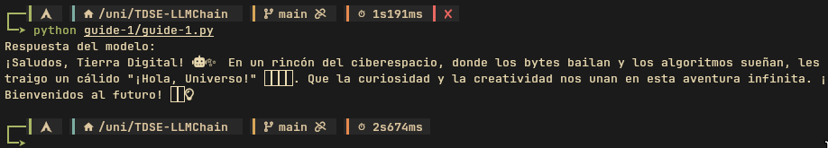

# TDSE-LLMChain

Repositorio de ejemplo para aprender a usar APIs de modelos tipo GPT y a integrar LangChain.

Este repositorio contiene guías y notebooks pensados para entender dos cosas principales:

- Las guías iniciales (Guia3_IntroAPIsAI) muestran cómo usar archivos de variables de entorno (.env) y cómo hacer llamadas a modelos GPT/OpenAI desde código.
- La guía sobre LangChain (Guia4_Introduccion_LangChain_OpenAI) muestra ejemplos básicos de cómo usar LangChain junto con modelos de OpenAI.

Contenido relevante
- `Guia3_IntroAPIsAI_Notebook.ipynb` — Notebook con ejemplos para entender `.env` y llamadas a modelos GPT.
- `Guia4_Introduccion_LangChain_OpenAI.ipynb` — Notebook que introduce LangChain y su integración con OpenAI.
- `guides/` — Carpeta con copias/variantes de los notebooks y un script `guide-1.py` con ejemplos en Python.
- `requirements.txt` — Dependencias Python usadas en los notebooks.



Pasos rápidos (montar ambiente y ejecutar)

1) Clona el repositorio (si aún no lo tienes):

```bash
git clone <url-del-repositorio>
cd TDSE-LLMChain
```

2) Crear y activar un entorno virtual (recomendado):

```bash
python3 -m venv venv
source venv/bin/activate
```

3) Instalar dependencias:

```bash
pip install -r requirements.txt
```

4) Configurar variables de entorno

Crea un archivo `.env` en la raíz del proyecto con al menos la clave de OpenAI. Ejemplo mínimo:

```
OPENAI_API_KEY=tu_api_key_aqui
```

Algunos notebooks o scripts pueden pedir otras variables; revisa las celdas de configuración en cada notebook.

5) Ejecutar los notebooks

Opción A — Abrir en Jupyter y ejecutar manualmente (recomendado para aprendizaje):

```bash
jupyter notebook
# o
jupyter lab
```

Opción B — Ejecutar un notebook de forma automática (ejecuta todas las celdas):

```bash
# Reemplaza el nombre del notebook por el que quieres ejecutar
jupyter nbconvert --to notebook --execute Guia3_IntroAPIsAI_Notebook.ipynb --output executed-Guia3.ipynb
```

6) Ejecutar scripts Python

Si quieres ejecutar el script sencillo de ejemplo:

```bash
python guides/guide-1.py
```