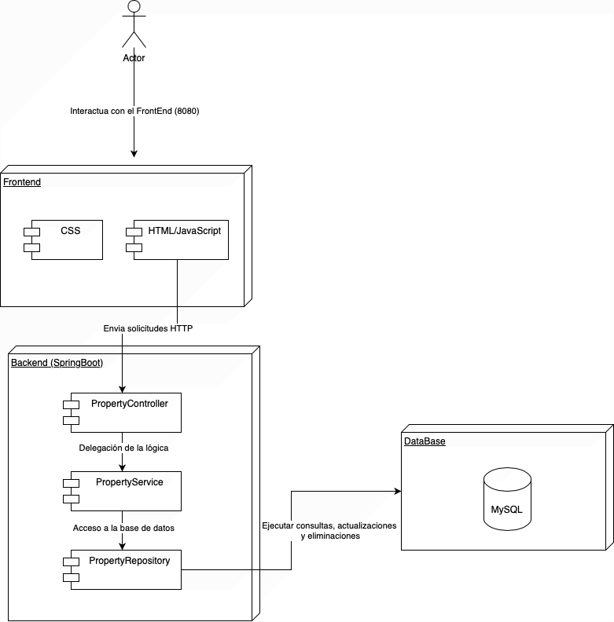
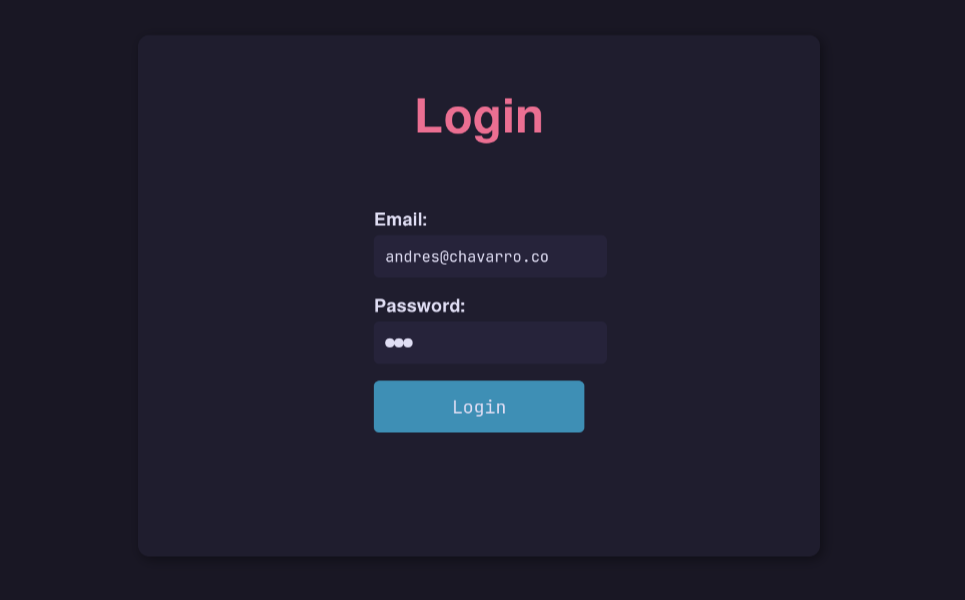
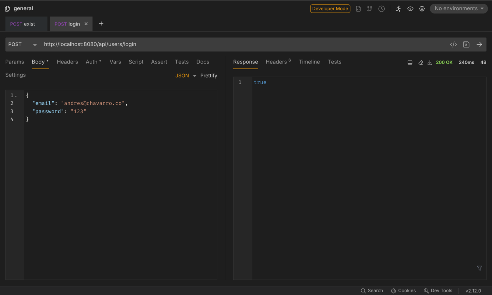
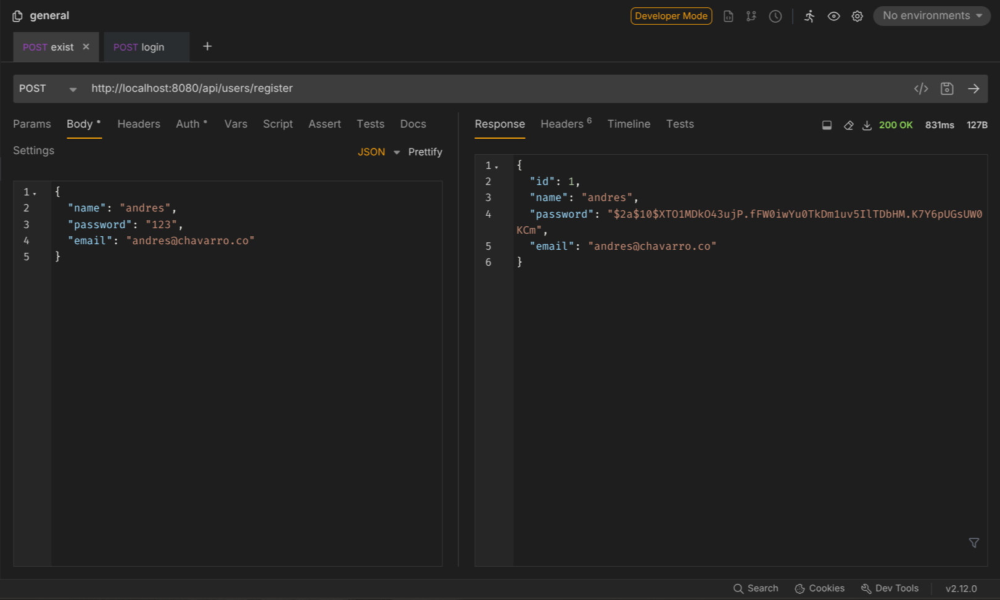
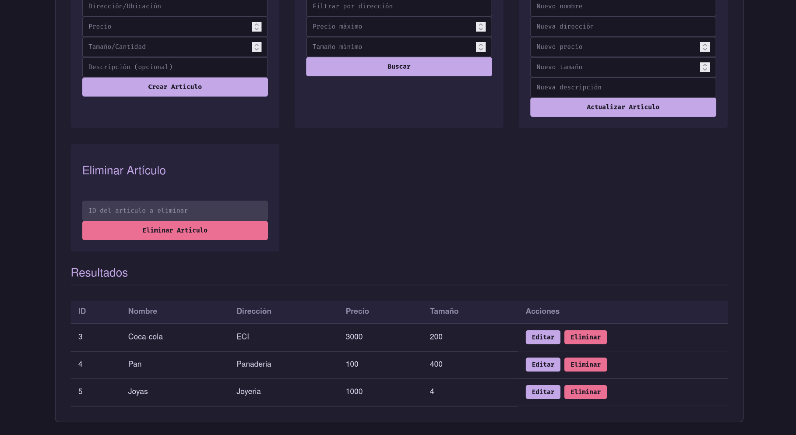
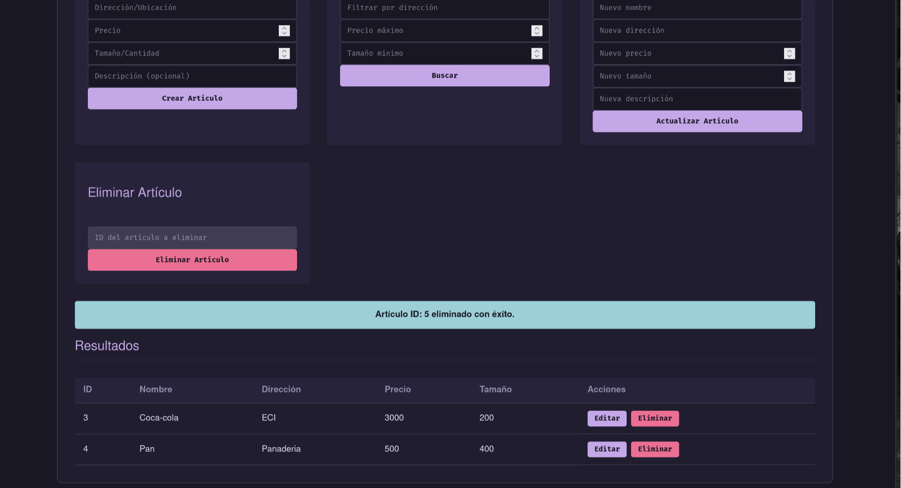
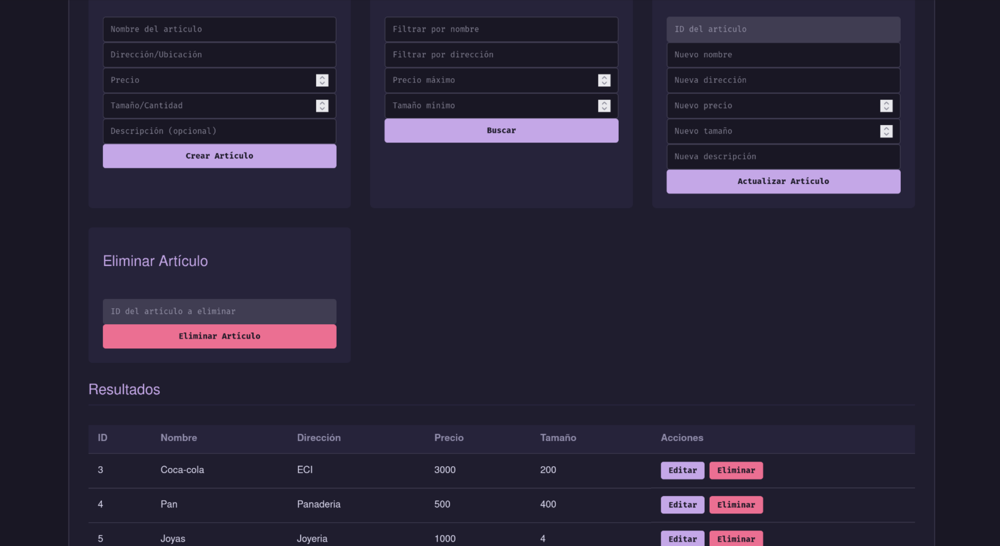
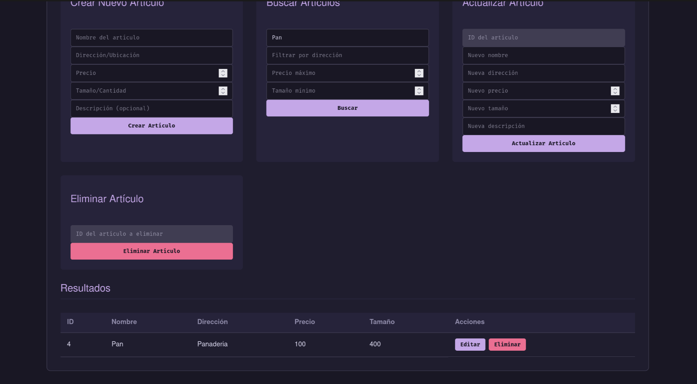
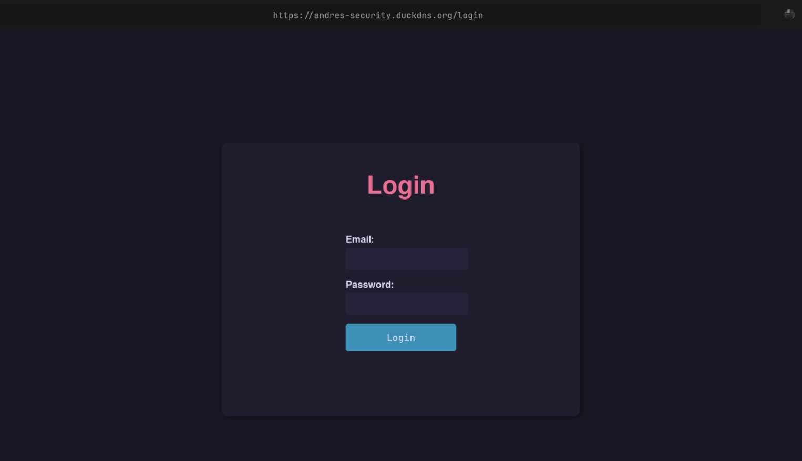
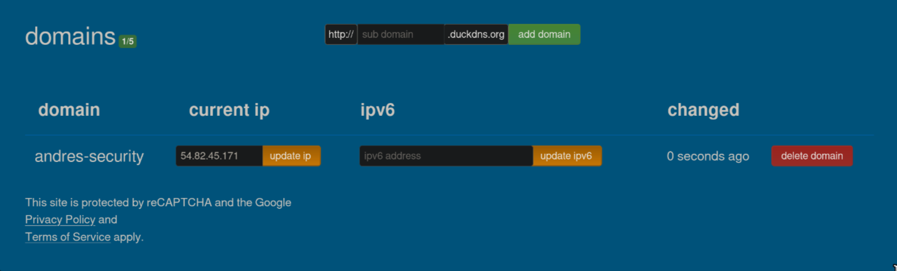

<div align="center">
<h1 align="center">Secure Property Management System</h1>
<p align="center">
A secure, enterprise-grade property management system built with Spring Boot, featuring SSL/TLS encryption, user authentication, and full CRUD operations with a modern web interface.
</p>
</div>

<br>

## Project Summary

This system is designed to manage property inventory through a secure web-based interface with user authentication and encrypted communications. The application provides complete Create, Read, Update, and Delete (CRUD) operations for property management with enterprise-level security features:

- **User Authentication**: Secure registration and login with BCrypt password hashing
- **SSL/TLS Encryption**: HTTPS communication via Apache reverse proxy with Let's Encrypt certificates
- **Property Management**: Add, view, update, and delete property listings
- **Advanced Search**: Filter properties by name, address, price range, and size
- **Pagination**: Efficient handling of large property datasets
- **RESTful API**: Complete REST API for user and property operations
- **Web Interface**: User-friendly HTML interface with login and property management
- **Data Persistence**: MySQL database integration with JPA/Hibernate
- **Containerized Deployment**: Docker and Docker Compose for easy deployment

### Video

https://github.com/user-attachments/assets/f1592b79-f4c9-4273-8a0b-9ac242b742b6

<br>

## System Architecture

### Two-Machine Architecture with SSL Termination

The system is deployed using a secure two-machine architecture:

**Machine A (Frontend - Reverse Proxy):**
- **Apache HTTPD** with SSL/TLS termination
- **Let's Encrypt SSL Certificate** for HTTPS encryption
- Listens on port **443** (HTTPS)
- Acts as reverse proxy forwarding to Machine B

**Machine B (Backend - Application Server):**
- **Docker & Docker Compose** environment
- **Spring Boot Application** (port 8080)
- **MySQL Database** (port 3306)
- Receives proxied HTTP requests from Machine A

### Traffic Flow

```
Client (HTTPS:443) 
    ↓
[Machine A - Apache HTTPD]
    - SSL/TLS Termination
    - Reverse Proxy Configuration
    ↓
(HTTP:8080)
    ↓
[Machine B - Docker Container]
    - Spring Boot App
    - MySQL Database
```

### Application Layer Architecture

1. **Client** sends HTTPS request to domain
2. **Apache HTTPD** (Machine A) receives HTTPS on port 443, decrypts traffic
3. **Reverse Proxy** forwards as HTTP to Machine B port 8080
4. **Spring Boot** receives request with proper headers via `server.forward-headers-strategy=FRAMEWORK`
5. **Controller** processes request and delegates to service layer
6. **Service** implements business logic and validation
7. **Repository** handles database operations using JPA
8. **MySQL Database** persists and retrieves data



## Security Features

### SSL/TLS Configuration (Machine A)

**Apache HTTPD SSL Configuration** (`/etc/httpd/conf.d/ssl.conf`):

**Key Configuration Points:**
- SSL certificates from Let's Encrypt (free, auto-renewable)
- HTTPS traffic on port 443 decrypted at Apache layer
- HTTP traffic forwarded to backend on port 8080
- Headers preserved for proper URL generation in Spring Boot

### Spring Boot Security Configuration (Machine B)

**Key Security Features:**
- BCrypt password hashing (cost factor: 10)
- Case-insensitive email handling (normalized to lowercase)
- Custom exception handling for authentication errors
- Secure password storage (never returned in API responses)

### User Authentication System

#### User Entity

```java
@Entity
@Table(name = "user")
public class User {
    @Id
    @GeneratedValue(strategy = GenerationType.IDENTITY)
    private Long id;
    private String name;
    private String email;
    private String password;   // BCrypt hashed
}
```

#### UserController Endpoints

- **POST `/api/users/register`** - Create new user account
  - Request: `{ "name": "John Doe", "email": "john@example.com", "password": "SecurePass123" }`
  - Response: User object with hashed password
  - Status: 200 OK or 400 Bad Request

- **POST `/api/users/login`** - Authenticate user
  - Request: `{ "email": "andres@chavarro.com", "password": "123" }`
  - Response: `true` on success
  - Status: 200 OK or 401 Unauthorized

<br>

### Core Classes

#### Inventory Entity

```java
@Entity
@Table(name = "inventory")
public class Inventory {
    @Id
    @GeneratedValue(strategy = GenerationType.IDENTITY)
    private Long id;
    private String name;
    private String address;
    private Integer price;
    private Integer size;
    private String description;
}
```

#### InventoryController

- **Purpose**: Handles HTTP requests and responses for property management
- **Endpoints**:
  - `POST /api/inventory` - Create new property
  - `GET /api/inventory` - Get all properties with pagination
  - `GET /api/inventory/search` - Search properties with filters
  - `PUT /api/inventory/{id}` - Update property
  - `DELETE /api/inventory/{id}` - Delete property

#### UserController

- **Purpose**: Handles HTTP requests for user authentication
- **Endpoints**:
  - `POST /api/users/register` - Register new user
  - `POST /api/users/login` - Authenticate user credentials

#### InventoryService
- **Purpose**: Implements business logic and validation for properties
- **Key Methods**:
  - `createItem()` - Property creation with validation
  - `getAllItems()` - Retrieve with pagination
  - `getFilteredItems()` - Dynamic search with specifications
  - `updateItem()` - Update existing property
  - `deleteItem()` - Property deletion

#### UserService
- **Purpose**: Implements authentication and user management logic
- **Key Methods**:
  - `createUser()` - User registration with BCrypt hashing
  - `login()` - Credential validation with BCrypt verification
  - `getUser()` - Retrieve user by email
  - `verify()` - Password verification helper

#### InventoryRepository
- **Purpose**: Data access layer using Spring Data JPA
- **Features**:
  - Automatic CRUD operations
  - Custom query methods
  - Specification-based dynamic queries

### Data Transfer Objects (DTOs)

- **InventoryCreateRequest**: For property creation
- **InventoryUpdateRequest**: For property updates
- **InventoryResponse**: For API responses
- **InventorySearchParams**: For search and filtering parameters

<br>

## Deployment Instructions

### Local Development

#### Clone the Repository

```bash
git clone https://github.com/Andr3xDev/TDSE-Security
cd TDSE-Security
```

#### Build and Run with Docker Compose

```bash
docker-compose up --build
```

#### Access the Application
- **Login Interface**: http://localhost:8080/login
- **Home Interface**: http://localhost:8080/home
- **API Base**: http://localhost:8080/api/*

<br>

### Production Deployment (Two-Machine Setup)

#### Machine A - Frontend (Reverse Proxy with SSL)

1. **Install Apache HTTPD**
```bash
sudo yum install httpd mod_ssl -y
sudo systemctl enable httpd
sudo systemctl start httpd
```

2. **Install Certbot for Let's Encrypt**
```bash
sudo yum install certbot python3-certbot-apache -y
sudo certbot --apache -d yourdomain.com
```

3. **Configure Apache as Reverse Proxy**

Edit `/etc/httpd/conf.d/ssl.conf`:

```apache
<VirtualHost *:443>
    ServerName yourdomain.com
    
    SSLEngine on
    SSLCertificateFile /etc/letsencrypt/live/yourdomain.com/cert.pem
    SSLCertificateKeyFile /etc/letsencrypt/live/yourdomain.com/privkey.pem
    SSLCertificateChainFile /etc/letsencrypt/live/yourdomain.com/chain.pem
    
    ProxyPreserveHost On
    ProxyPass / http://<MACHINE_B_IP>:8080/
    ProxyPassReverse / http://<MACHINE_B_IP>:8080/
    
    RequestHeader set X-Forwarded-Proto "https"
    RequestHeader set X-Forwarded-Port "443"
</VirtualHost>
```

4. **Restart Apache**
```bash
sudo systemctl restart httpd
```

5. **Configure Firewall**
```bash
sudo firewall-cmd --permanent --add-service=http
sudo firewall-cmd --permanent --add-service=https
sudo firewall-cmd --reload
```

#### Machine B - Backend (Application Server)

1. **Install Docker and Docker Compose**
```bash
sudo yum install docker -y
sudo systemctl enable docker
sudo systemctl start docker
sudo curl -L "https://github.com/docker/compose/releases/latest/download/docker-compose-$(uname -s)-$(uname -m)" -o /usr/local/bin/docker-compose
sudo chmod +x /usr/local/bin/docker-compose
```

2. **Clone and Configure Application**
```bash
git clone https://github.com/Andr3xDev/TDSE-Security
cd TDSE-Security
```

3. **Update application.properties**
```properties
server.forward-headers-strategy=FRAMEWORK
server.port=8080

spring.datasource.url=jdbc:mysql://localhost:3306/properties
spring.datasource.username=root
spring.datasource.password=your_secure_password

spring.jpa.hibernate.ddl-auto=update
```

4. **Deploy with Docker Compose**
```bash
sudo docker-compose up -d --build
```

5. **Verify Deployment**
```bash
sudo docker ps
sudo docker logs <container_id>
```

#### Access the Production Application
- **HTTPS URL**: https://yourdomain.com
- **Login Page**: https://yourdomain.com/login
- **API**: https://yourdomain.com/api/

<br>

### Docker Containerization

The application uses Docker and Docker Compose for containerized deployment, ensuring consistency across all environments:

**Key Features:**
- **Multi-container setup**: Spring Boot application + MySQL database
- **Automated builds**: Dockerfile with multi-stage build optimization
- **Environment configuration**: Externalized configuration via environment variables
- **Volume persistence**: MySQL data persisted across container restarts
- **Network isolation**: Containers communicate via Docker internal network

**Environment Variables:**
```bash
# Database Configuration
SPRING_DATASOURCE_URL=jdbc:mysql://mysql:3306/properties
SPRING_DATASOURCE_USERNAME=root
SPRING_DATASOURCE_PASSWORD=your_secure_password

# Application Configuration
SERVER_PORT=8080
SERVER_FORWARD_HEADERS_STRATEGY=FRAMEWORK
SPRING_JPA_HIBERNATE_DDL_AUTO=update
```

This containerized approach simplifies deployment, scaling, and ensures the application runs consistently across development, staging, and production environments.

<br>

## API Testing

### User Registration Endpoint

**POST** `https://yourdomain.com/api/users/register`

**Request Body:**
```json
{
  "name": "John Doe",
  "email": "john.doe@example.com",
  "password": "SecurePassword123!"
}
```

**Success Response (200 OK):**
```json
{
  "id": 1,
  "name": "John Doe",
  "email": "john.doe@example.com",
  "password": "$2a$10$N9qo8uL...hashed..."
}
```

**Error Response (400 Bad Request):**
```json
"Email already registered"
```

### User Login Endpoint

**POST** `https://yourdomain.com/api/users/login`

**Request Body:**
```json
{
  "email": "john.doe@example.com",
  "password": "SecurePassword123!"
}
```

**Success Response (200 OK):**
```json
true
```

**Error Response (401 Unauthorized):**
```json
"Invalid password"
```
or
```json
"User not found"
```

### Property Management Endpoints

**Create Property** - `POST /api/inventory`
```json
{
  "name": "Luxury Apartment",
  "address": "123 Main St, New York",
  "price": 500000,
  "size": 120,
  "description": "Beautiful 2-bedroom apartment"
}
```

**Search Properties** - `GET /api/inventory/search?name=Luxury&minPrice=100000&maxPrice=600000&page=0&size=10`

**Update Property** - `PUT /api/inventory/{id}`

**Delete Property** - `DELETE /api/inventory/{id}`

## Screenshots

### Login Interface
Secure login page with email and password authentication. All passwords are hashed using BCrypt before storage.



### API Endpoints Testing
Testing the authentication endpoints using REST client tools like Bruno or Postman.

* Example: POST /api/users/register endpoint*



* Example: POST /api/users/login endpoint with successful authentication*



### Main Dashboard
The main interface shows the property management dashboard with forms for creating new properties and a searchable list of existing properties. Access requires user authentication.

* Example: Property management dashboard (authenticated users only)*



* Example: Creating a new property listing*
 


* Example: Advanced search with filtering by name, address, price, and size*



* Example: Detailed property view with update and delete options*




### SSL/TLS Certificate
Let's Encrypt certificate configuration ensuring secure HTTPS communication. Using the custom domain.




