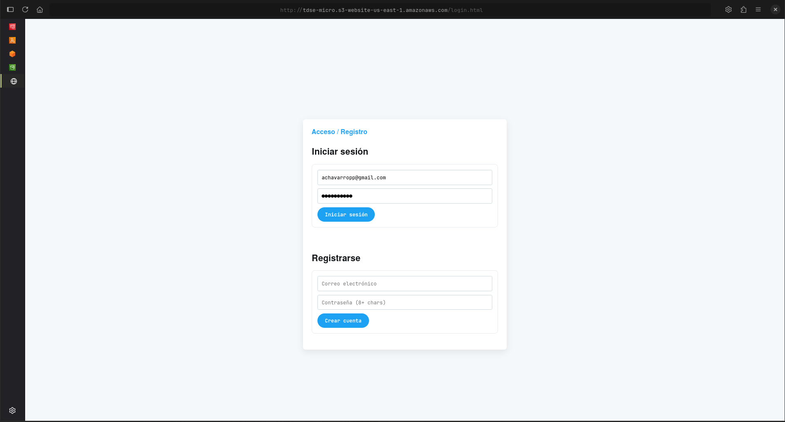
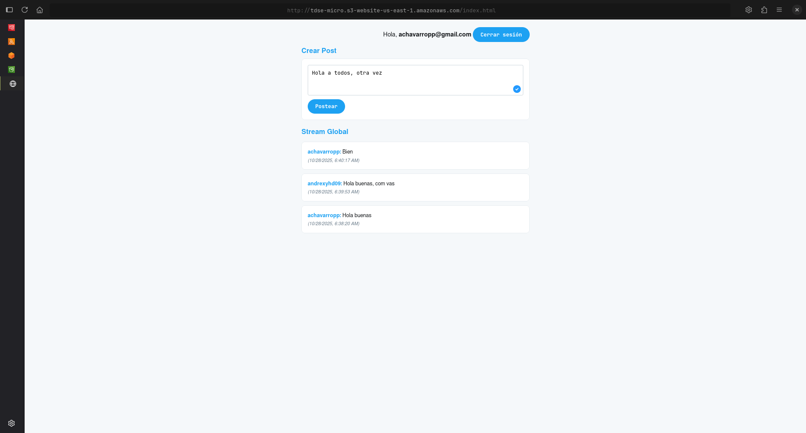
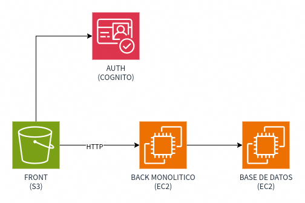
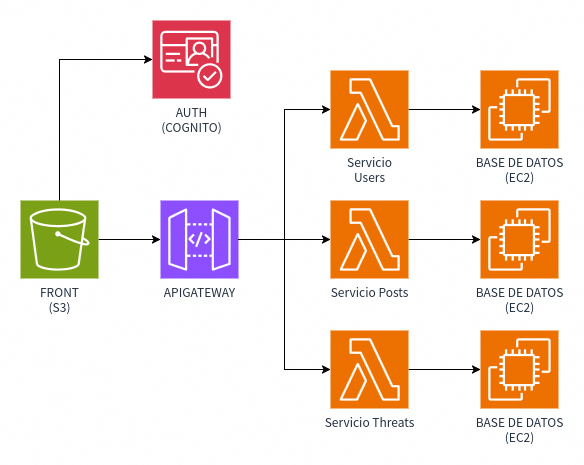
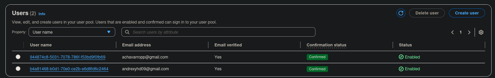
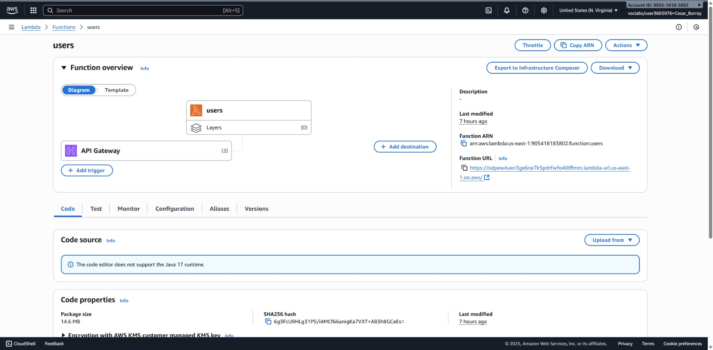
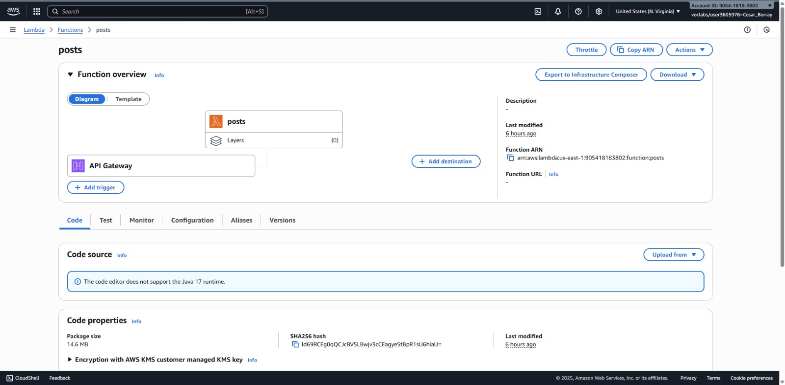
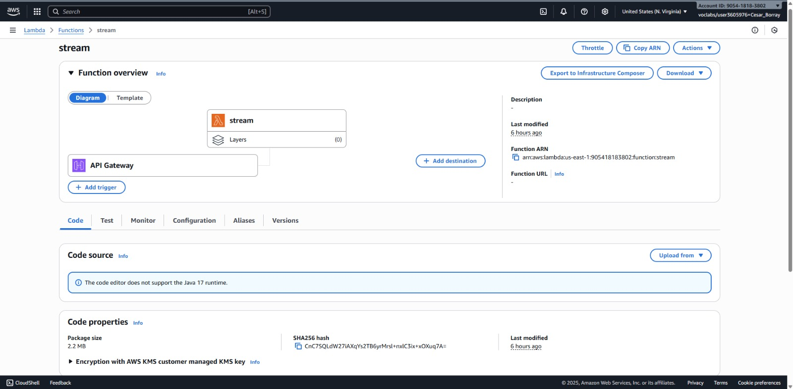
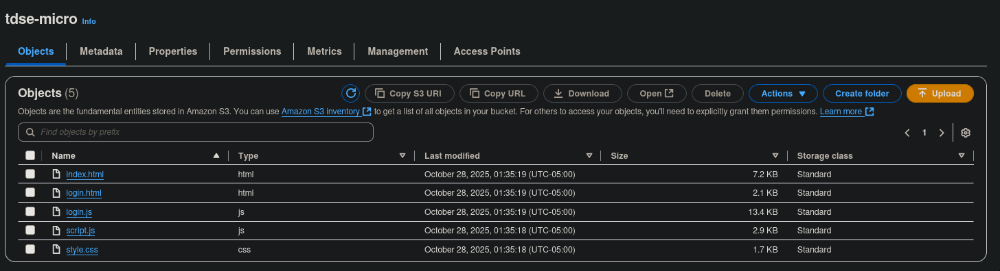
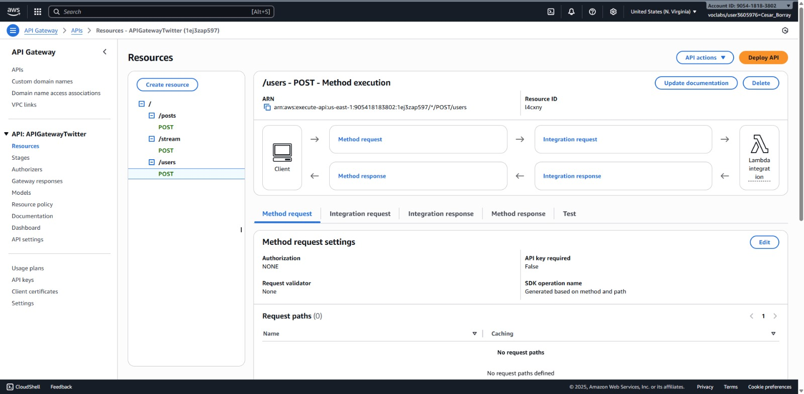

## TDSE Microservices - Twitter Clone

### Videos de Demostración

Este proyecto incluye **2 videos demostrativos** que muestran el funcionamiento completo de la aplicación:

1. **Video 1 - Demostración de Funcionalidades**: Registro, autenticación, creación de posts y visualización del stream
2. **Video 2 - Arquitectura y Despliegue en AWS**: Configuración de servicios AWS (S3, Lambda, API Gateway, Cognito)

**[Ver Video de Demostración 1 Aquí](media/v1.mp4)**
**[Ver Video de Demostración 2 Aquí](media/v1.mp4)**

---

### Instalación y Ejecución Local

#### Prerrequisitos

- Java 17 o superior
- Maven 3.9+
- Git

#### Clonar el Repositorio

```bash
git clone https://github.com/Andr3xDev/TDSE-microservices.git
cd TDSE-microservices
```

#### Ejecutar el Backend

```bash
cd microservice
./mvnw spring-boot:run
# El servidor estará disponible en http://localhost:8084
```

#### Ejecutar el Frontend

```bash
cd client
python3 -m http.server 8080
# Accede a: http://localhost:8080
```

#### Vista de la Aplicación

##### Página de Login y Registro



La aplicación inicia con una página de autenticación donde los usuarios pueden registrarse o iniciar sesión utilizando AWS Cognito.

##### Aplicación Principal - Stream de Posts



Una vez autenticado, el usuario accede a la vista principal donde puede crear posts de hasta 140 caracteres y visualizar el stream global con todas las publicaciones en tiempo real.

---

### Descripción del Proyecto

Este proyecto implementa una aplicación tipo Twitter que permite a los usuarios crear posts de hasta 140 caracteres y visualizarlos en un stream global. La aplicación evoluciona desde una arquitectura monolítica hacia una arquitectura de microservicios desplegada en AWS.

#### Características Principales

- ✅ **Sistema de Posts**: Creación y visualización de posts de hasta 140 caracteres
- ✅ **Stream Global**: Feed unificado con todos los posts en tiempo real
- ✅ **Gestión de Usuarios**: Registro, autenticación y perfiles de usuario
- ✅ **Autenticación JWT**: Seguridad implementada con AWS Cognito
- ✅ **API RESTful**: Endpoints bien definidos y documentados
- ✅ **Frontend Responsivo**: Interfaz web moderna desplegada en S3
- ✅ **Arquitectura de Microservicios**: Separación en servicios independientes con AWS Lambda

---

### Arquitectura

#### Fase 1: Monolito Spring Boot

La aplicación se desarrolló inicialmente como un monolito Spring Boot integrando todos los servicios (User, Post, Stream) en una única aplicación con base de datos H2.



#### Fase 2: Microservicios con AWS Lambda

La aplicación se separó en tres microservicios independientes desplegados en AWS Lambda, comunicándose a través de API Gateway con el frontend alojado en S3.



---

### Entidades del Sistema

El sistema está compuesto por tres entidades principales:

#### 1. Usuario (User)
Representa a los usuarios registrados en el sistema con su información de autenticación de AWS Cognito.

**Atributos principales:**
- `cognitoId`: Identificador único de AWS Cognito (PK)
- `username`: Nombre de usuario
- `email`: Correo electrónico

#### 2. Post
Representa una publicación o mensaje en el sistema.

**Atributos principales:**
- `id`: Identificador único (PK)
- `content`: Contenido del post (máximo 140 caracteres)
- `timestamp`: Fecha y hora de creación
- `user`: Relación con el usuario autor (FK)

#### 3. Stream (Hilo)
Representa un feed o hilo que agrupa posts.

**Atributos principales:**
- `id`: Identificador único (PK)
- `name`: Nombre del stream
- `posts`: Lista de posts asociados

#### Diagrama de Relaciones (ER)

```
┌─────────────────┐
│      User       │
│─────────────────│
│ - cognitoId (PK)│
│ - username      │
│ - email         │
└────────┬────────┘
         │ 1
         │
         │ creates
         │
         │ *
┌────────▼────────┐         ┌─────────────────┐
│      Post       │         │     Stream      │
│─────────────────│         │─────────────────│
│ - id (PK)       │    *    │ - id (PK)       │
│ - content       │◄────────┤ - name          │
│ - timestamp     │ belongs │ - posts[]       │
│ - user_id (FK)  │   to    │                 │
└─────────────────┘         └─────────────────┘
```

---

### API REST Endpoints

#### Base URL
- **Local**: `http://localhost:8084`
- **AWS**: `https://[api-gateway-id].execute-api.us-east-1.amazonaws.com/prod`

#### Endpoints de Usuarios

##### Crear Usuario
```http
POST /api/users
Content-Type: application/json

{
  "cognitoId": "us-east-1:xxxxx-xxxx-xxxx",
  "username": "johndoe",
  "email": "john@example.com"
}
```

##### Obtener Todos los Usuarios
```http
GET /api/users
```

##### Obtener Usuario por ID
```http
GET /api/users/{cognitoId}
```

#### Endpoints de Posts

##### Crear Post
```http
POST /api/posts
Content-Type: application/json

{
  "content": "Este es mi primer tweet!",
  "user": {
    "cognitoId": "us-east-1:xxxxx-xxxx-xxxx"
  }
}
```

##### Obtener Todos los Posts
```http
GET /api/posts
```

##### Obtener Post por ID
```http
GET /api/posts/{id}
```

##### Eliminar Post
```http
DELETE /api/posts/{id}
```

#### Endpoints de Streams

##### Crear Stream
```http
POST /api/streams
Content-Type: application/json

{
  "name": "Global Stream"
}
```

##### Obtener Todos los Streams
```http
GET /api/streams
```

##### Agregar Post a Stream
```http
POST /api/streams/{streamId}/posts/{postId}
```

##### Obtener Posts de un Stream
```http
GET /api/streams/{streamId}/posts
```

---

### Seguridad con AWS Cognito

El proyecto implementa autenticación y autorización mediante **AWS Cognito User Pool** con tokens JWT.

#### Configuración

```javascript
const USER_POOL_ID = 'us-east-1_iqWLwfBuk';
const APP_CLIENT_ID = '6bv9e50dsog1bd3oall4aentnr';
```

#### Funcionalidades de Autenticación

- **Registro de Usuarios**: Validación de email y contraseña segura con código de confirmación
- **Inicio de Sesión**: Autenticación con email/contraseña y generación de tokens JWT
- **Cierre de Sesión**: Invalidación de tokens y limpieza de sesión
- **Protección de Rutas**: Verificación de sesión activa en páginas protegidas



Los tokens JWT generados por Cognito incluyen información del usuario (email, username) y son utilizados para autenticar las peticiones al backend.

---

### Microservicios Lambda

La arquitectura de microservicios separa la aplicación monolítica en **tres funciones Lambda independientes**, cada una responsable de un dominio específico del negocio.

#### 1. User Service Lambda

**Responsabilidad**: Gestión completa del ciclo de vida de usuarios.

**Funcionalidades**:
- Creación de nuevos usuarios vinculados con Cognito
- Consulta de información de usuarios
- Actualización de perfiles
- Gestión de datos de usuario

**Endpoints manejados**:
- `POST /api/users`
- `GET /api/users`
- `GET /api/users/{cognitoId}`



#### 2. Post Service Lambda

**Responsabilidad**: Gestión de publicaciones y contenido.

**Funcionalidades**:
- Creación de posts con validación de 140 caracteres
- Recuperación de posts individuales o listados
- Eliminación de posts
- Asociación de posts con usuarios

**Endpoints manejados**:
- `POST /api/posts`
- `GET /api/posts`
- `GET /api/posts/{id}`
- `DELETE /api/posts/{id}`



#### 3. Stream Service Lambda

**Responsabilidad**: Gestión de feeds y agregación de posts.

**Funcionalidades**:
- Creación y gestión de streams
- Agregación de posts en streams
- Recuperación de posts por stream
- Ordenamiento temporal de contenido

**Endpoints manejados**:
- `POST /api/streams`
- `GET /api/streams`
- `GET /api/streams/{id}`
- `POST /api/streams/{streamId}/posts/{postId}`
- `GET /api/streams/{streamId}/posts`



#### Comunicación con el Frontend

Los tres microservicios Lambda se exponen a través de **AWS API Gateway**, que actúa como punto de entrada único para todas las peticiones. El frontend desplegado en S3 realiza llamadas HTTPS al API Gateway, que enruta las solicitudes al Lambda correspondiente según el endpoint.

**Flujo de comunicación**:
```
Frontend (S3) → API Gateway → Lambda (User/Post/Stream) → Response
```

El API Gateway también se encarga de:
- Validación de tokens JWT con Cognito
- Gestión de CORS para permitir peticiones desde S3
- Throttling y rate limiting
- Logging y monitoreo con CloudWatch

---

### Despliegue en AWS

#### Frontend en Amazon S3

El frontend está desplegado como un sitio web estático en Amazon S3 con acceso público.



**URL del Frontend**: `http://TDSE-micro.s3-website-us-east-1.amazonaws.com`

**Pasos de despliegue**:
1. Crear bucket de S3 con nombre único
2. Habilitar hosting de sitio web estático
3. Configurar política de acceso público
4. Subir archivos HTML, CSS y JavaScript

#### Backend con AWS Lambda

Los tres microservicios están desplegados como funciones Lambda independientes que se conectan con un API Gateway que enruta las peticiones HTTP a las funciones Lambda correspondientes y maneja la autenticación con Cognito.



---

### Pruebas

#### Pruebas Unitarias

El proyecto incluye tests unitarios para todos los servicios (User, Post, Stream) con una cobertura del 91%.

```bash
cd microservice
./mvnw test
```

**Resultados**:
- Total de tests: 57
- Tests pasados: 57
- Cobertura: 91%

#### Pruebas Funcionales

Las pruebas funcionales validan el flujo completo de la aplicación desde el registro hasta la creación de posts:

##### Flujo de Autenticación

1. Navegar a la página de login
2. Registrar un nuevo usuario con email y contraseña
3. Confirmar cuenta con código enviado por email
4. Iniciar sesión con credenciales

##### Flujo de Creación de Posts

1. Con sesión activa, escribir un post (máx. 140 caracteres)
2. Click en "Postear"
3. El post aparece inmediatamente en el stream global
4. Verificar que muestra el usuario autor y timestamp